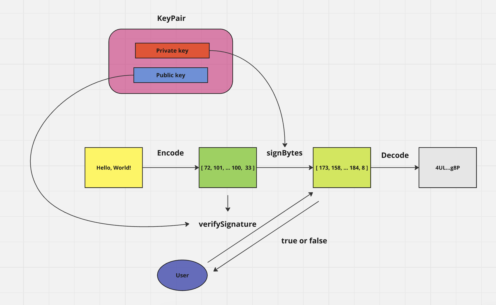

### 0 create a project

`npm init -y`

### 1 Install @solana/web3.js version 2

`npm install @solana/web3.js@2`

check the version

`npm list @solana/web3.js`

### 3 generate a keypair

`generateKeyPair`

### 4 encode a message

`getUtf8Encoder().encode`

### 5 sign the encoded message

`signBytes`

### 6 decode the signature(if you want)

`getBase58Decoder().decode`

### 7 verify the Signature

`verifySignature`
